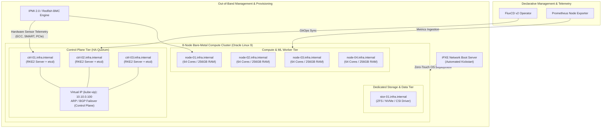

# Bare-Metal High-Availability RKE2 Compute Fleet & GitOps Platform


> [!IMPORTANT]
> **Confidentiality, Sanitization & NDA Notice:**  
> This repository is a sanitized, abstracted reference architecture derived from hands-on production engineering of physical bare-metal fleets and distributed Kubernetes clusters. 
> All proprietary enterprise assets, internal IP addresses, company-specific hostnames, and secrets have been thoroughly purged and replaced with generic RFC-compliant parameters. 
> The commit history is initialized independently to maintain strict confidentiality and security standards.

---

## 1. Physical Fleet Architecture



---

## 2. Engineering Specifications & Pillars

### A. Zero-Touch Bare-Metal Fleet Provisioning
* **iPXE Boot Engine:** Network bootstrapping across physical servers utilizing UEFI iPXE chaining with DHCP Option 67.
* **Automated OS Deployment:** Kickstart profiles (`oracle-linux-9.ks`) establishing:
  * Predictable partition layouts with LVM and XFS.
  * Deterministic network interface bonding (`802.3ad LACP`).
  * Kernel parameter hardening: `vm.swappiness=10`, `fs.file-max=2097152`, NUMA balancing, and hugepages pre-allocation.

### B. Out-of-Band (OOB) Telemetry & Hardware Diagnostics
* Custom asynchronous Python daemon (`bmc_redfish_health.py`) interfacing with server Baseboard Management Controllers (BMC) via Redfish APIs.
* Continuous monitoring and Prometheus metric exposition for:
  * Correctable/Uncorrectable Memory ECC errors.
  * NVMe/SATA drive SMART indicators (reallocated sectors, wear level).
  * PCIe bus error rates and thermal headroom telemetry.

### C. High-Availability Control Plane (kube-vip)
* Production-grade virtual IP failover managed by `kube-vip` running as a DaemonSet across the 3 control-plane nodes.
* Eliminates external hardware load balancer dependencies for the Kubernetes API server endpoint (`https://10.10.0.100:6443`).

### D. Declarative GitOps Operations (FluxCD)
* Zero manual cluster configuration drift.
* Source controllers, Kustomization reconciliation, and HelmReleases managing core infrastructure:
  * `ingress-nginx` with dual internal/external ingress classes.
  * `cert-manager` for dynamic PKI certificate automation.
  * `kube-prometheus-stack` with tuned Alertmanager rules.

---

## 3. Repository Structure

```text
├── docs/
│   ├── architecture.md            # Low-level network topology & hardware design
│   └── failure-domain-testing.md  # Stress test results, node drain, and VIP failover benchmarks
├── hardware/
│   ├── ipxe/
│   │   ├── boot.ipxe              # iPXE network boot script
│   │   └── oracle-linux-9.ks      # Kickstart OS configuration & sysctl tuning
│   └── telemetry/
│       └── bmc_redfish_health.py  # Out-of-band Redfish telemetry collector
├── cluster/
│   ├── inventory/
│   │   └── hosts.example.ini      # Fleet inventory (3 control, 4 workers, 1 storage)
│   ├── kube-vip/
│   │   └── kube-vip-daemonset.yaml# HA Virtual IP control plane configuration
│   └── rke2/
│       └── config.yaml.example    # CIS hardened RKE2 configuration template
└── gitops/
    └── flux-system/
        ├── gotk-sync.yaml         # Flux GitOps reconciliation root
        ├── infrastructure/        # HelmReleases: cert-manager, ingress, storage CSI
        └── monitoring/            # HelmReleases: prometheus-operator, grafana, loki
```

---

## 4. Hardware Failure & Recovery Validation

| Failure Scenario | Recovery Mechanism | Measured Time to Recovery | SLA Impact |
| :--- | :--- | :--- | :--- |
| **Control-Plane Master Hard Power-Off** | `kube-vip` Virtual IP ARP gratuitous announcement to peer master | **~1.2 seconds** | Zero API server request drop |
| **Worker Node Kernel Panic (OOM/Crash)** | Kubernetes node lifecycle controller evicts pods after heartbeat timeout | **40 seconds** | Workloads rescheduled automatically |
| **NVMe Storage Read Degraded** | ZFS mirror scrubbing & SMART telemetry trigger Alertmanager page | **Instant notification** | Zero data loss, proactive replacement |

---

## 5. Security & Maintenance
Maintained by **Temirbek Rakhimgalyiev** ([LinkedIn](https://www.linkedin.com/in/temirbek-rakhimgalyiev-443174246/)).  
All configurations conform to CIS Kubernetes Hardening benchmarks and Linux low-latency operational standards.
